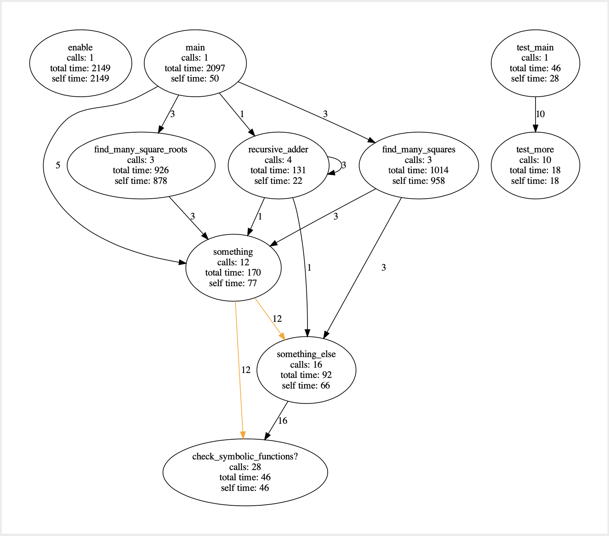

# TraceGraph

_**Current Version: 0.1.0**_

This gem creates a graph of all the method calls made for a given block of code.
The graph includes the number of calls made, time spent in the method and time spent by other methods

The graph generated will give a rough idea about the execution flow and performance

>Note: This gem is still in beta version and hence currently you can use the gem from the specific branch of **path-maker**
>**Master** branch is yet to be confirmed and merged. So for now specify the source and branch.

>Another Note: This gem is still not published to any sources and hence this will require git source mentioning explicitly.
## Installation
Dependent installation is graphviz library.
Which is quintessential for this to generate the graph
link: https://graphviz.org/download/

`brew install graphviz`

Add this line to your application's Gemfile:

To Use Specific branch, say path-maker:
```ruby
gem 'trace_graph', git: "https://github.com/ramemanatingideas/trace_graph", branch: 'path-maker'
```

```ruby
gem 'trace_graph'
```

And then execute:

    $ bundle install

Or install it yourself as:

    $ gem install trace_graph

## Usage

**Example usage you can refer to `trail_runner.rb` file which has the basic example.**

To trace the calls
`TraceGraph::Finder.init_trace()` is the parent method

A block is given as the param to the method to run the tracer.

The tracer will then trace the block that is given. This can be a method call or object initialization.
```ruby
class SomeClass
    def some_method
        puts "hello world"
    end

    def something_else
        puts "something_else hello world"
    end
end

obj = SomeClass.new

TraceGraph::Finder.init_trace do
    obj1 = SomeClass.new

    # this will be traced
    obj.some_method
    # this will be traced
    obj1.some_method
end
# this will not be traced
obj.something_else
```

This block can be called within a method also and anywhere in the code. It will trace from that point of execution specified.
i.e
```ruby
def some_method
    res = get_primes(numbers)
    TraceGraph::Finder.init_trace do
        sum = sum_primes(res)
        square_of_primes = square_primes(res)
    end

    [square_of_primes, sum]
end
```

Just dont use it on this project itself :stuck_out_tongue_winking_eye:

#### Preferences
This class holds all the options that the user would want to use on the tracer to apply it in the graph.
**This is optional and not mandatory.**
Preferences currently in place:
* Method Node colouring : To highlight the specified nodes in the graph (For one more methods)
 `method_nodes = { 'method1': 'color1', 'method1': 'color2'}`
* Trace Path: To highlight all possible paths from given source to destination. Also can specify the color of the path edges (optional)
 `trace_path = { source: 'check_symbolic_functions?', dest: 'main', color: 'orange'}`
* Trace Output File: To specify the output file name
 `trace_output_file = 'file_name'`
* Trace Time Unit: To specify the time unit for the profiling in the nodes [ms, s, min]
* Trace Depth: To specify the depth of the trace on how many levels of calls should be considered 
 `trace_depth = 2`
* Trace File Type: Specify the file type of the generated graph (currently can generated PDF and SVG)
 `trace_type = 'svg'`
* Trace Neighbours: To get the nearest nodes that are calling the given node and optionally highlight the nodes 
 `trace_neighbours = {method: 'method1', color: 'blue'}`, this can be extended for multiple nodes also

**Usage Example**
___You can also create muliple preferences objects and pass as param to the tracer___
```ruby
# Normal way to initialize (unclean way)
prefs2 = TraceGraph::Preferences.new
prefs2.method_color = 'red'
prefs2.method_name = 'find_many_square_root'
prefs2.method_nodes = {'something': 'red', 'something_else': 'green', 'recursive_adder': 'pink'}
prefs2.trace_depth = 2
prefs2.trace_path = { source: 'check_symbolic_functions?', dest: 'main'}

# Another clean approach to intialize an object using block
# This is the best way to group up the preferences and set values
prefs = TraceGraph::Preferences.new do |p|
  p.trace_path = { source: 'main', dest: 'check_symbolic_functions?', color: 'violet' }
  p.method_nodes = {'something': 'red', 'something_else': 'green', 'recursive_adder': 'pink'}
  p.trace_output_file = 'trace_graph_new_name'
end

# Usage in the TraceGraph
TraceGraph::Finder.init_trace(preferences: prefs) do
  t = Trial.new
  t.main
end
```

**Preferences are optional**
Eg:

```ruby
TraceGraph::Finder.init_trace(preferences: nil) do
  t = Trial.new
  t.main
end

# Or even like this

TraceGraph::Finder.init_trace do
  t = Trial.new
  t.main
end
```

#### Options or features
* Basic Call Graph
* Node colouring (single and multiple)
* Trace Path (for given source and destination nodes for chosen colour)
* Trace depth (TODO)
* Profiling (with units)
* Highlight Caller and Callee nodes for specified method
* Consolidates Metrics of the method calls (TODO)

**You can use this anywhere in the code, you can also call this inside a method and it will trace for that block of code from the point of execution, This can be executed for runtime or for a defined test case**.

>Currently for rails for tracing controller level calls it is best to use this on a Test for the controller as it will trace the action as well. This can still be used in the controller without any issues.

Eg:
```ruby
TraceGraph::Finder.init_trace do
  obj = SomeClass.new
  obj.some_method
end

# if you want to run with specific preferences
# eg for having coloured output for method nodes in the graph
prefs = Preferences.new
prefs.method_nodes = {'some_method': 'green'}
TraceGraph::Finder.init_trace(preferences: prefs) do
  obj = SomeClass.new
  obj.some_method
end
```

_*For valid colour values refer to the following link [Graphviz supported Colours](https://graphviz.org/doc/info/colors.html)*_

**To highlight all paths from source to destination**:

>Important Note: This feature heavily depends on the nature of the calls and hence will take time for large graphs since this tries to find all possible paths from one node to another. Hence dont expect immediate results. Preferably evaluate on normal run without specifying the trace_path to check the nature of the graph and then proceed.

`Preferences.trace_path = {source: 'node1_name', destination: 'node2_name'}`

__This wil take default green colour for all paths edges__
>Default color is green as I like it.

__For specific color__

`Preferences.trace_path = {source: 'node1_name', destination: 'node2_name', color: 'red'}`

```ruby
prefs = Preferences.new
prefs.trace_path = {source: 'find_many_square_roots', dest: 'check_symbolic_methods?'}
TraceGraph::Finder.init_trace(preferences: prefs) do
  obj = SomeClass.new
  obj.some_method
end

```

Eg Result of trace_path :


**To highlight all outgoing or incoming paths to nodes from given node**:

**For Incoming:**

`Preferences.trace_callers = {method: 'method1', color: 'blue'}`
```ruby
prefs = TraceGraph::Preferences.new do |p|
  p.trace_callers = {method: 'something', color: 'blue'}
end
```

Result of Trace Caller:


**For Outgoing:**

`Preferences.trace_callees = {method: 'method1', color: 'orange'}`
```ruby
prefs = TraceGraph::Preferences.new do |p|
  p.trace_callees = {method: 'something', color: 'orange'}
end
```

Result of Trace Callee:


### Trace Depth:
You can set any depth for the tracer and it will trace upto that.
This is very helpful when you have a huge graph and want to analyze specifically.
Also using the other features like trace_path will be faster due to reduced graph size.
Improves the performance overall.

All of the features can be combined with this depth.
```ruby
prefs = TraceGraph::Preferences.new do |p|
  p.trace_depth = 1 
end
```

Result of Trace Depth:
Depth : 1


Depth tracing takes 0 index. eg: depth of 3 will be 0,1,2.

More examples of depth:

No depth given:


Depth of 1:


>Note : Filtering of method calls for internal methods is yet to be done so if you directly use this in rails you might see a huge graph
>which might take some time to process due to many internal calls rails makes.

> Non-Blocking generation of the graph is yet to be done so as of now it runs in the main thread
>which means it will block the execution and generate. Parallelism is still in progress.

## Development

After checking out the repo, run `bin/setup` to install dependencies. Then, run `rake spec` to run the tests. You can also run `bin/console` for an interactive prompt that will allow you to experiment.

To install this gem onto your local machine, run `bundle exec rake install`. To release a new version, update the version number in `version.rb`, and then run `bundle exec rake release`, which will create a git tag for the version, push git commits and tags, and push the `.gem` file to [rubygems.org](https://rubygems.org).

## Contributing

Bug reports and pull requests are welcome on GitHub at https://github.com/ramemanatingideas/trace_graph. This project is intended to be a safe, welcoming space for collaboration, and contributors are expected to adhere to the [code of conduct](https://github.com/ramemanatingideas/trace_graph/blob/master/CODE_OF_CONDUCT.md).

Check the Projects Tab which has a Kanban of items.
you can add features to it or take up any of the items and convert it to an issue and pull request to it

All are welcome to suggest any new additions to this project, if any add it to the Kanban

## Further Enhancements or maintainance
The projects tab has the list of items that are taken as part of enhancements and maintainance. Any new suggestions are accepted.


## License

The gem is available as open source under the terms of the [MIT License](https://opensource.org/licenses/MIT).

## Code of Conduct

Everyone interacting in the TraceGraph project's codebases, issue trackers, chat rooms and mailing lists is expected to follow the [code of conduct](https://github.com/ramemanatingideas/trace_graph/blob/master/CODE_OF_CONDUCT.md).
